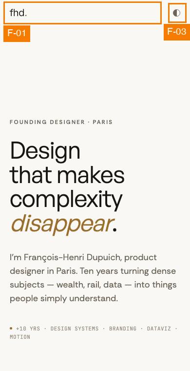
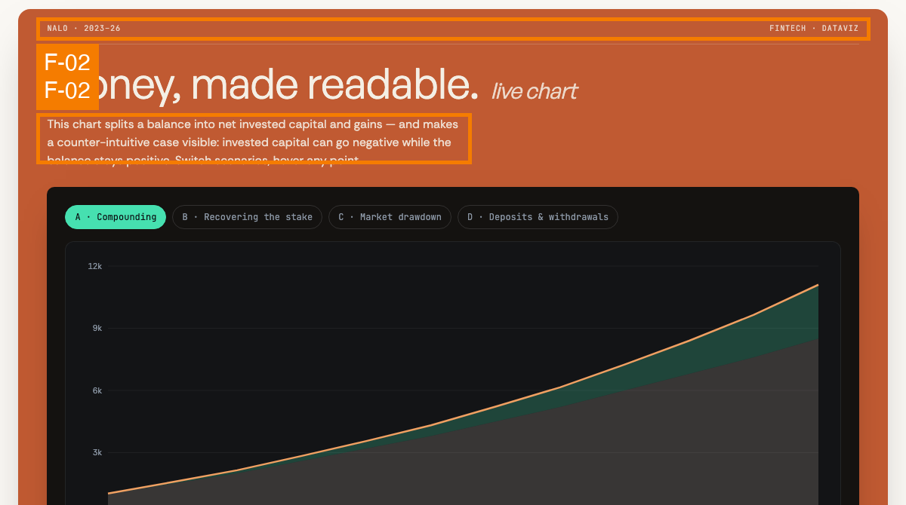
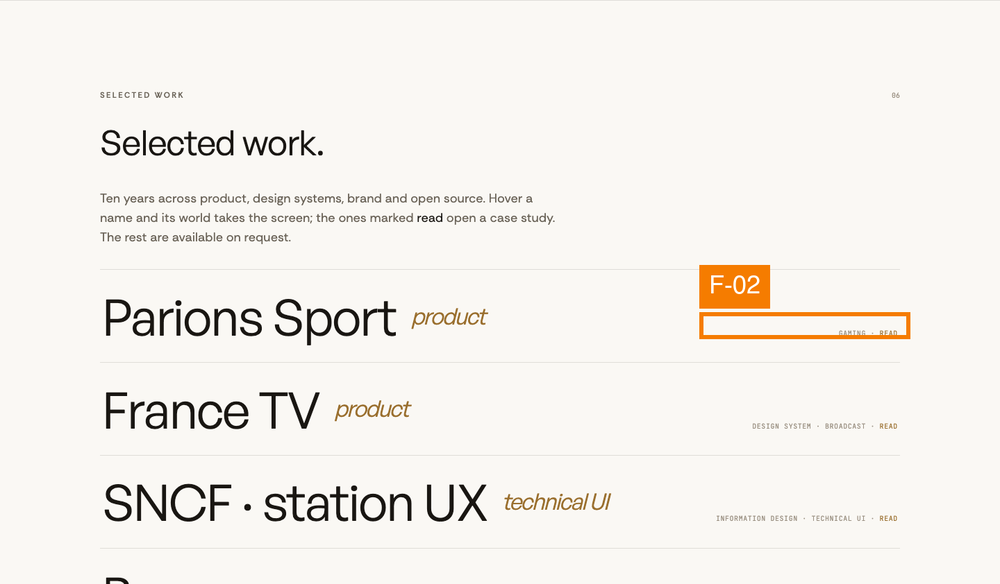
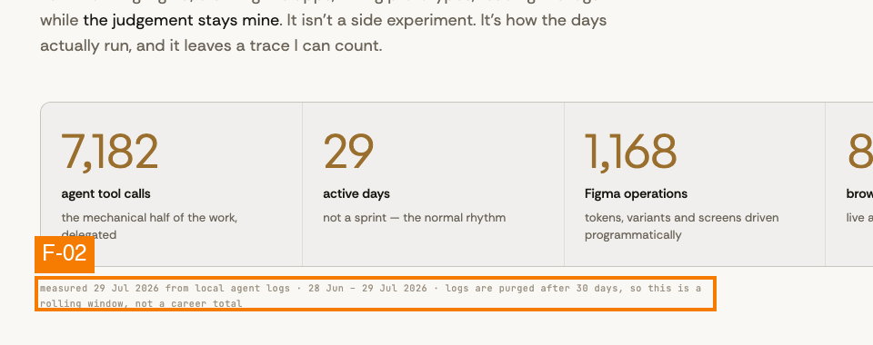
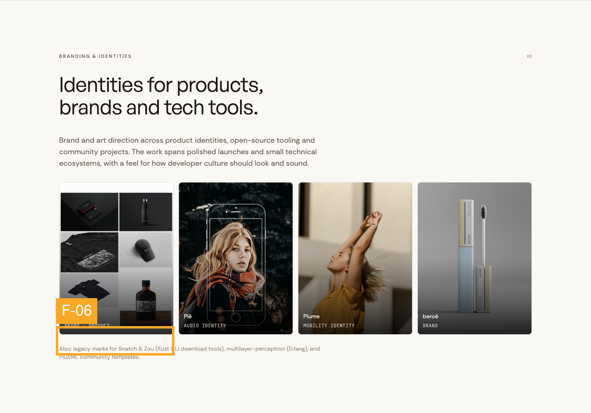
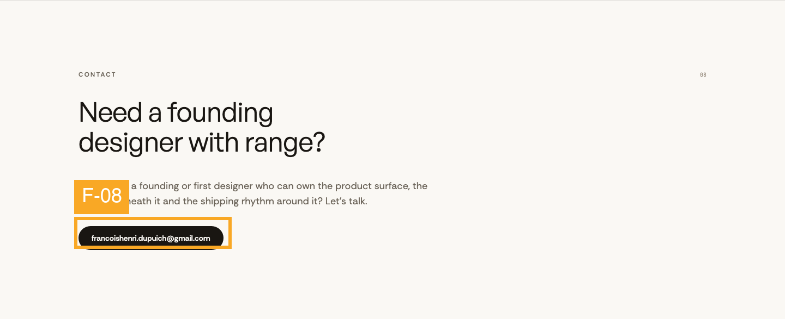
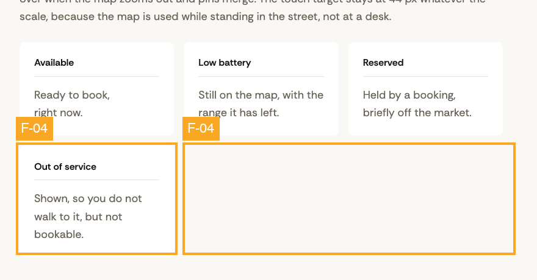
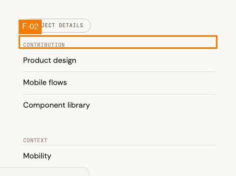
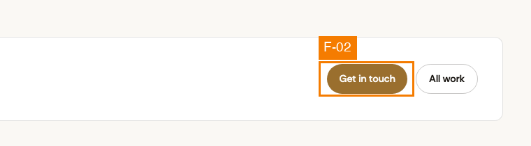
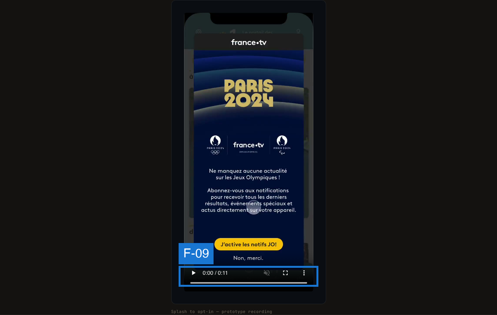

# Audit UX, folio FH : de l'atterrissage à la prise de contact

## Résumé exécutif

Le site tient sa promesse sur le fond : la thèse (« founding designer avec du range ») est portée par des preuves vivantes — graphiques Recharts, tableau SNCF, ledger IA daté et sourcé — et non par des captures d'écran. La structure éditoriale, le fil d'ariane des études de cas et le thème clair sont solides.

Trois choses menacent réellement l'objectif. **(1) Sous 768 px, il n'y a aucune navigation** : les sept ancres du header sont en `display:none` et aucun menu ne les remplace, sur une page qui fait 15 051 px de haut — un visiteur mobile venu de LinkedIn n'a littéralement aucun moyen d'atteindre « Contact » autrement qu'en faisant défiler la page entière. **(2) Huit familles de texte passent sous le seuil AA de 4,5:1**, mesurées au pixel sur les rendus, dont la sous-titraille de la carte Nalo (3,35:1) et le marqueur `READ` qui est la seule signalétique « cette ligne ouvre une étude de cas ». **(3) Le seul contrôle du header en mobile fait 15 × 15 px**, soit un tiers du plancher WCAG.

Ces trois points coûtent doublement ici : ils gênent l'usage, et ils contredisent le propos du site, qui revendique de l'accessibilité RGAA 4 et une obsession du poids livré. Top 3 des correctifs : un menu mobile, un relèvement de `--color-faint` / `--color-accent` / de la terracotta, et des zones tactiles de 44 px.

## Périmètre & méthode

- **Objectif évalué :** un décideur (recruteur, founder, DPE) comprend en quelques minutes ce que FH sait faire, ouvre au moins une étude de cas, et repart avec un moyen de le contacter.
- **Type d'utilisateur / plateforme :** première visite, desktop-web (1440 × 900) et mobile-web (390 × 844, `mobile: true`).
- **Build audité :** `dist/` construit depuis `main` au commit `d3f445b`, servi en local sur `:4399`.
- **Écrans :**

| # | Fichier | Écran |
|---|---------|-------|
| 1 | `c-mobile-header.png` | Home, header + hero — 390 px |
| 2 | `c-deck-terracotta.png` | Home, carte « Money, made readable » (Nalo) — clair |
| 3 | `c-work-rows.png` | Home, index « Selected work » — clair |
| 4 | `c-ledger.png` | Home, ledger IA + légende de provenance — clair |
| 5 | `c-brand-grid.png` | Home, grille brand — clair |
| 6 | `c-contact.png` | Home, section Contact — clair |
| 7 | `c-facts-orphan.png` | `/work/cityscoot`, grille de faits — clair |
| 8 | `c-details-head.png` | `/work/cityscoot`, bloc « Contribution » — clair |
| 9 | `c-cta.png` | `/work/cityscoot`, CTA de fin — clair |
| 10 | `c-motion.png` | `/work/france-tv`, vidéo dans le device frame — sombre |

- **Frameworks appliqués :** Nielsen, Shneiderman, Gerhardt-Powals, Bastien & Scapin, lois comportementales (Fitts, Hick, Jakob, Miller, Peak-End), Fogg B=MAP, Cialdini, Gestalt, Norman, Tognazzini, WCAG 2.1 (sous-ensemble vérifiable), heuristiques de content design.
- **Méthode de mesure :** pilotage de Chrome en CDP (`Page.captureScreenshot` plein document + `Runtime.evaluate`). Les ratios de contraste sont **mesurés sur les pixels du rendu** (formule de luminance relative WCAG appliquée aux couleurs effectivement peintes), pas calculés depuis les styles déclarés — c'est indispensable ici puisque les opacités et les `color-mix()` déplacent la couleur réelle. Les tailles de cible et les dimensions d'image viennent de `getBoundingClientRect()` / `naturalWidth`.
- **Non évaluable sur des captures statiques :** ordre de focus et visibilité du focus, navigation clavier complète, restitution lecteur d'écran, comportement `prefers-reduced-motion`, latence réelle et Core Web Vitals, comportement des vidéos une fois la lecture lancée, gate mot de passe en production.

## Vue d'ensemble des constats

| ID | Sév | Écran | Check | Constat | Heuristiques |
|----|-----|-------|-------|---------|--------------|
| F-01 | 3 | 1 | DEAD-END | Aucune navigation sous 768 px sur une page de 15 051 px | Nielsen #6, Tog: visible navigation, Jakob, WCAG 2.4.5 |
| F-02 | 3 | 2,3,4,8,9 | CONTRAST-FAIL | 8 familles de texte entre 2,52:1 et 4,48:1 | WCAG 1.4.3, B&S: lisibilité |
| F-03 | 3 | 1,3 | TOUCH-TARGET | Bascule de thème 15 × 15 px, ancres 39 × 20 px | WCAG 2.5.5 / 2.5.8, Fitts |
| F-04 | 2 | 7 | HIERARCHY-FLAT | La grille de faits orpheline sa 4ᵉ carte (3 + 1) | Gestalt: proximité / région commune, G-P #6 |
| F-05 | 2 | — | ASSET-BLOAT | Images servies 2,2× à 3,8× leur taille d'affichage | Tog: latence, cohérence avec le propos |
| F-06 | 2 | 5 | LABEL-DOUBT | « Black Sales » vs `blacksails.jpg` ; wordmark illisible | Content #5, B&S: signification des codes |
| F-07 | 2 | — | — | La légende SNCF est dupliquée mot pour mot | Content #9, Nielsen #8 |
| F-08 | 2 | 6 | — | La fin de parcours n'offre qu'une adresse e-mail | Peak-End, Fogg: prompt, Cialdini: autorité |
| F-09 | 1 | 10 | CONTROL-OCCLUSION | Les contrôles vidéo natifs s'affichent dans la maquette de téléphone | Norman: modèle conceptuel |
| F-10 | 1 | — | — | La planche Cityscoot reconstruite est annotée en français | Content #10 |

---

## Écran par écran

### Écran 1 : Home, header + hero — 390 px (`c-mobile-header.png`)

#### [S3] F-01 · Sous 768 px, le site n'a plus de navigation du tout

- **Check :** DEAD-END · **Heuristiques :** Nielsen #6 (reconnaître plutôt que se rappeler), Tognazzini (navigation visible), Jakob's Law, WCAG 2.4.5 (plusieurs moyens d'accès)
- **Preuve :** `Header.astro` déclare `<nav data-anchors class="… hidden items-center gap-6 md:flex">`. Mesuré dans le navigateur à 390 px : les sept ancres (`Cases`, `Motion`, `Systems`, `Brand`, `Work`, `Approach`, `Contact`) renvoient toutes `width: 0, height: 0`. Aucun bouton burger, aucun panneau de repli n'existe dans le composant. Le header mobile contient exactement deux éléments : le mot-repère `fhd.` et la pastille de thème. La page mesure **15 051 px** de haut.
- **Impact sur l'objectif :** c'est le trajet le plus probable vers ce site — un lien LinkedIn ouvert sur téléphone. Le visiteur ne peut ni sauter aux études de cas, ni atteindre la section Contact autrement qu'en parcourant les 15 051 px. Le seul raccourci restant est le lien d'évitement, qui mène à `<main>`, c'est-à-dire au début.
- **Recommandation :** ajouter un bouton menu sous `md` qui ouvre un panneau plein écran reprenant les mêmes ancres, plus « All work » et l'adresse e-mail. Fermeture au `Escape`, au clic sur une ancre et au clic hors panneau ; `aria-expanded` sur le bouton. · **Effort :** M

#### [S3] F-03 · La bascule de thème fait 15 × 15 px

- **Check :** TOUCH-TARGET · **Heuristiques :** WCAG 2.5.5 (44 px), WCAG 2.5.8 AA (24 px plancher), Fitts's Law
- **Preuve :** `.theme-btn { width: 15px; height: 15px }` dans `global.css`; mesuré `15 × 15` à 390 px. C'est **le seul contrôle** du header en mobile. Sur desktop, les ancres mesurent `39 × 20 px` (`Cases`) et le fil d'ariane des études de cas `93 × 16 px`.
- **Impact sur l'objectif :** un utilisateur qui rate la pastille bascule le thème par erreur ou abandonne ; sur un site dont une étude de cas revendique « touch targets that survive a thumb on a moving list », c'est une contradiction visible.
- **Recommandation :** garder le disque de 15 px comme signe visuel, mais lui donner une zone d'appui de 44 px (padding + `background: transparent`, ou un `::after` en `inset: -15px`). Même traitement pour les ancres et le fil d'ariane : `min-height: 44px` via padding vertical, sans changer la ligne de base typographique. · **Effort :** S

---

### Écran 2 : Home, carte Nalo (`c-deck-terracotta.png`)

#### [S3] F-02 · Huit familles de texte sous le seuil AA

- **Check :** CONTRAST-FAIL · **Heuristiques :** WCAG 1.4.3, B&S (lisibilité), G-P #9
- **Preuve :** ratios mesurés sur les pixels du rendu.

| Élément | Où | Mesuré | Requis | Cause |
|---|---|---|---|---|
| `.case-head` (`NALO · 2023-26`) | carte terracotta | **3,03:1** | 4,5 | `opacity: 0.8` sur `#c05a32` |
| `.deck-lede` | carte terracotta | **3,35:1** | 4,5 | `opacity: 0.88` sur `#c05a32` |
| `.case-note` | carte terracotta | **≈3,4:1** | 4,5 | `opacity: 0.7` sur `#c05a32` |
| `.ledger-caption` | ledger IA | **2,52 / 2,75:1** | 4,5 | `--color-faint` |
| `.case-details-head` | étude de cas | **2,59:1** | 4,5 | `--color-faint` |
| `.case-caption` | étude de cas | **2,81–2,94:1** | 4,5 | `--color-faint` |
| `.work-row-meta` + `READ` | index work | **2,89 / 3,59:1** | 4,5 | `--color-faint`, `--color-accent` clair |
| `.case-cta-primary` | étude de cas, clair | **4,22:1** | 4,5 | `--color-accent` clair |

Trois causes racines seulement : le jeton `--color-faint` (`#6f685c` en sombre, `#9c9284` en clair), le jeton `--color-accent` en thème clair (`#9a6f2e`), et la pile d'opacités posée sur la carte terracotta `#c05a32` — le fond est déjà à 3,86:1 pour du texte plein, et chaque `opacity` le fait descendre encore.

- **Impact sur l'objectif :** `.work-row-meta` porte le marqueur `READ`, seul signal indiquant qu'une ligne ouvre une étude de cas ; `.case-cta-primary` est le bouton « Get in touch » de fin d'étude de cas. Ce ne sont pas des ornements, ce sont les deux points de conversion. Les légendes portent la provenance des chiffres — l'argument d'honnêteté du site.
- **Recommandation :** remonter les jetons plutôt que patcher les classes.
  - sombre `--color-faint` `#6f685c` → `#8a8274` (4,92:1 sur `#141210`, 4,60:1 sur `#1c1916`)
  - clair `--color-faint` `#9c9284` → `#786f63` (4,66:1 sur `#faf8f4`)
  - clair `--color-accent` `#9a6f2e` → `#8a6327` (5,08:1 dans les deux sens : texte accent sur papier, et ivoire sur pastille accent)
  - carte Nalo `#c05a32` → `#a94f2c` (même teinte 16,9°, même saturation, 12 % plus sombre — 4,76:1 pour l'ivoire), et supprimer les `opacity` de `.case-head`, `.deck-lede`, `.case-note` : la hiérarchie est déjà portée par la taille, la casse et le mono. · **Effort :** S

---

### Écran 3 : Home, index « Selected work » (`c-work-rows.png`)

Occurrence de **F-02** : `GAMING · READ` en 9,9 px, gris à 2,89:1 et or à 3,59:1, à 1 000 px du nom du projet. La ligne entière est cliquable (Fitts OK), mais le signifiant est à la fois minuscule et pâle — Norman : le signifiant existe, il n'est simplement pas perceptible. Le paragraphe d'intro l'explique (« the ones marked read open a case study »), ce qui est une bonne compensation, mais oblige à retenir la règle (Miller / RECALL-TAX).

---

### Écran 4 : Home, ledger IA (`c-ledger.png`)

Occurrence de **F-02** : `.ledger-caption` à **2,52:1** en sombre. C'est la ligne qui date et source les chiffres (« measured 29 Jul 2026 from local agent logs »). Sur une section dont l'argument est la vérifiabilité, la mention de provenance est le texte le moins lisible de la page.

---

### Écran 5 : Home, grille brand (`c-brand-grid.png`)

#### [S2] F-06 · « Black Sales » ou « Black Sails » ?

- **Check :** LABEL-DOUBT · **Heuristiques :** Content #5 (un terme par concept), B&S (signification des codes)
- **Preuve :** le site affiche `Black Sales` (`index.astro:28`, `src/content/work/black-sales.json`), le visuel s'appelle `blacksails.jpg`, et l'univers de la planche (gravure XVIIIᵉ, flacons ambrés, noir mat) évoque la marque « Black Sails ». **Le wordmark imprimé sur le t-shirt est illisible** : le fichier source ne fait que 595 px de large, l'agrandissement ne permet pas de trancher.
- **Impact sur l'objectif :** si c'est une coquille, elle porte sur un nom de client, sur une planche mise en avant — c'est exactement le type de détail qu'un recruteur remarque. Si ce n'est pas une coquille, c'est le nom de fichier qui ment.
- **Recommandation :** trancher côté FH, aligner les trois emplacements (`index.astro`, le JSON, le nom du fichier), et reprendre la planche à une résolution où le wordmark se lit. **Non corrigé dans cette passe** : la preuve disponible ne permet pas de choisir sans se tromper sur un nom de marque. · **Effort :** S

---

### Écran 6 : Home, section Contact (`c-contact.png`)

#### [S2] F-08 · Le point culminant du parcours n'offre qu'une adresse e-mail

- **Heuristiques :** Peak-End Rule, Fogg (prompt + ability), Cialdini (autorité), Nielsen #7
- **Preuve :** la section « Need a founding designer with range? » se termine sur une seule pastille, `francoishenri.dupuich@gmail.com`. Aucun CV, aucun LinkedIn, aucune indication de disponibilité ou de format recherché (CDI ? mission ? à partir de quand ?).
- **Impact sur l'objectif :** c'est l'écran que le visiteur retiendra. Un recruteur en phase de sourcing ne rédige pas un e-mail à froid : il enregistre un profil, transfère un lien, vérifie un parcours. Le seul geste proposé est le plus coûteux des trois. L'adresse Gmail affaiblit par ailleurs le signal d'autorité sur un site qui a son propre domaine.
- **Recommandation :** ajouter à côté de la pastille un lien LinkedIn et un lien CV (PDF), et une ligne d'état d'une phrase (« Basé à Paris · ouvert aux rôles founding / first designer · à partir de … »). Envisager une adresse sur le domaine. **Non corrigé dans cette passe** : les URL et l'état de disponibilité appartiennent à FH. · **Effort :** S

---

### Écran 7 : `/work/cityscoot`, grille de faits (`c-facts-orphan.png`)

#### [S2] F-04 · La grille de faits laisse sa 4ᵉ carte seule sur une ligne

- **Check :** HIERARCHY-FLAT · **Heuristiques :** Gestalt (proximité, région commune), G-P #6 (groupement cohérent)
- **Preuve :** `.case-facts { grid-template-columns: repeat(auto-fit, minmax(14rem, 1fr)) }`. Mesuré sur `/work/cityscoot` : conteneur de 792 px, gouttière de 16 px → 3 colonnes de 253 px, 4 éléments, **2 lignes**. La carte « Out of service » se retrouve seule à gauche avec 62 % de la ligne vide à sa droite.
- **Impact sur l'objectif :** les quatre états d'un marqueur de carte forment un ensemble ; les casser en 3 + 1 suggère visuellement une hiérarchie qui n'existe pas — le lecteur cherche pourquoi le quatrième est à part. C'est le cas sur toutes les études de cas dont un bloc porte quatre faits.
- **Recommandation :** dériver le nombre de colonnes du nombre d'éléments plutôt que de la largeur : 2 colonnes par défaut, puis en large 3 colonnes, et 2 × 2 dès qu'il y a un 4ᵉ enfant (`:has(> :nth-child(4))`). · **Effort :** S

---

### Écran 8 : `/work/cityscoot`, bloc « Contribution » (`c-details-head.png`)

Occurrence de **F-02** : les intitulés du bloc de méta-données (`Contribution`, `Sector`, `Year`, `Tools`) sont à **2,59:1**. Ce sont les étiquettes qui rendent la colonne lisible ; sans elles, la colonne est une liste de valeurs sans clés (B&S : guidage / incitation).

---

### Écran 9 : `/work/cityscoot`, CTA de fin (`c-cta.png`)

Occurrence de **F-02** : « Get in touch », pastille pleine en accent, texte ivoire à **4,22:1** en thème clair — sous le seuil, sur l'action de conversion principale de la page. Le bouton secondaire « All work » passe, lui, sans problème.

---

### Écran 10 : `/work/france-tv`, vidéo dans le device frame (`c-motion.png`)

#### [S1] F-09 · Les contrôles vidéo natifs s'affichent à l'intérieur de la maquette de téléphone

- **Check :** CONTROL-OCCLUSION *(nouvel ID)* · **Heuristiques :** Norman (modèle conceptuel), Jakob's Law
- **Preuve :** `CaseFigure.astro:41` pose l'attribut `controls` sur les vidéos d'étude de cas. Sur `/work/france-tv`, la barre `0:00 / 0:11` + volume + plein écran + menu est peinte en bas de l'écran du téléphone, plus une piste de progression. La grille motion de la home, elle, retire les contrôles (`site.ts:302`) et propose un clic-plein-écran — deux traitements différents pour le même objet (PATTERN-DRIFT).
- **Nuance :** la vidéo se lance en `IntersectionObserver` et les contrôles natifs s'estompent pendant la lecture ; **l'état réel en lecture n'est pas évaluable sur une capture statique**. Ce qui est certain, c'est l'état au repos, avant l'entrée dans le viewport et après la sortie.
- **Recommandation :** aligner les deux surfaces — pas de `controls` quand la vidéo est rendue dans un cadre d'appareil, et réutiliser l'affordance clic-plein-écran de la grille motion. · **Effort :** S

---

## Constats transverses

#### [S2] F-05 · Les images sont servies 2,2× à 3,8× trop grandes

- **Check :** ASSET-BLOAT *(nouvel ID)* · **Heuristiques :** Tognazzini (réduction de latence)
- **Preuve :** rapport `naturalWidth / largeur affichée` mesuré sur la home à 1440 px : `ple-cover.jpg` 981 → 258 px (**3,8×**), `plume-cover.jpg` 989 → 261 px (3,8×), `beroe.jpg` 1100 → 310 px (3,55×), `cosmoconnected.jpg` 884 → 311 px (2,84×), `cityscoot.jpg` 942 → 350 px (2,69×), `ftv.jpg` 592 → 199 px (2,98×). Quatorze images dépassent 1,8×. Le `loading="lazy"` est en place partout, ce qui limite le coût au premier rendu.
- **Impact sur l'objectif :** faible sur l'usage (chargement paresseux, images modestes en valeur absolue), réel sur la crédibilité : le site argumente explicitement sur le poids livré et l'artisanat technique.
- **Recommandation :** générer des variantes et poser un `srcset` / `sizes` sur la grille brand et les vignettes. **Non corrigé dans cette passe** : les mêmes fichiers sont réutilisés à des tailles différentes selon les surfaces (grille home, hero d'étude de cas, prev/next), il faut décider des points d'arrêt avant de générer les variantes — c'est une passe à part, pas un correctif de token. · **Effort :** M

#### [S2] F-07 · La légende du tableau SNCF est dupliquée mot pour mot

- **Heuristiques :** Content #9 (chaque mot gagne sa place), Nielsen #8
- **Preuve :** `index.astro:160` affiche `live · recreated in the browser · split-flap included` juste sous `SncfBoard.astro:130` qui affiche déjà `live · recreated in the browser`. Les deux lignes sont visibles simultanément, à quelques dizaines de pixels l'une de l'autre.
- **Recommandation :** garder la version interne au tableau et réduire la note externe à ce qu'elle ajoute (`split-flap included`). · **Effort :** S

#### [S1] F-10 · La planche Cityscoot reconstruite est annotée en français

- **Heuristiques :** Content #10 (localisable), Nielsen #4
- **Preuve :** les SVG reconstruits (`public/work/rebuilt/cityscoot-*.svg`) portent des annotations en français sur un site entièrement rédigé en anglais, et redisent ce que la grille de faits anglaise dit déjà juste au-dessus.
- **Nuance :** les libellés d'interface en français sont **justes** — l'étude de cas dit explicitement que le produit parle à la première personne en français (« Je réserve mon Cityscoot »). Seule la couche d'annotation doit changer de langue.
- **Recommandation :** passer les annotations en anglais, laisser l'interface reconstruite en français. · **Effort :** S

### Cohérence inter-écrans

Les composants sont stables d'une étude de cas à l'autre : même en-tête, même fil d'ariane, même bloc de méta-données, même paire de CTA en pied de page (WCAG 3.2.3 / 3.2.4 : OK). Le seul écart relevé est le traitement des vidéos (F-09).

### Charge mémoire et progression

La page d'accueil est un one-pager de 15 051 px sans indicateur de position autre que les numéros de section (`06`, `08`) en haut à droite, discrets et non cliquables. Sur desktop, les ancres du header compensent. Sur mobile, rien ne compense (F-01), et il n'y a donc plus ni carte mentale ni raccourci : le visiteur ne sait pas combien il reste.

### Peak-End

- **Point bas :** la section Contact (F-08) — un seul geste possible, et le plus coûteux.
- **Point haut :** le tableau SNCF et les graphiques Nalo, qui sont des démonstrations exécutables. C'est la meilleure idée du site.
- **Fin :** correcte sur les études de cas (prev/next + double CTA), faible sur la home.

### Diagnostic Fogg (B = MAP) sur l'action clé : « prendre contact »

- **Prompt :** présent et bien placé en fin d'étude de cas ; sur la home il n'existe qu'après 11 664 px de défilement, et sur mobile il n'y a aucun raccourci vers lui (F-01). *Manque de déclencheur.*
- **Ability :** le geste demandé — rédiger un e-mail à froid — est le plus coûteux du répertoire (effort mental + non routinier). Un lien LinkedIn ou un CV en un clic serait bien plus accessible (F-08). *Trop dur.*
- **Motivation :** bien tenue, c'est la force du site — la preuve exécutable et le ledger daté font le travail de réassurance mieux que n'importe quel argumentaire. Le seul accroc est que les mentions de provenance, qui portent la crédibilité, sont le texte le moins lisible de la page (F-02).

## Ce qui fonctionne (à garder)

- **[P-01] Les bases d'accessibilité structurelle sont en place** : lien d'évitement, `lang="en"`, `<main>`, titres et descriptions propres à chaque page, `og:` renseignés. Le socle est bon — les manques sont dans la couche visuelle, pas dans le HTML. *(WCAG 2.4.1, 2.4.2)*
- **[P-02] L'état « Supprimé » du tableau SNCF ne repose pas sur la couleur seule** : croix + texte barré + libellé. C'est exactement ce que demande WCAG 1.4.1, appliqué là où c'était le plus facile de tricher. *(WCAG 1.4.1, Tog)*
- **[P-03] La légende de provenance du ledger IA** dit d'où viennent les chiffres et à quelle date ils ont été mesurés, au lieu de les asséner. C'est du content design honnête, et c'est rare. *(Content #7)*
- **[P-04] Fil d'ariane + prev/next sur chaque étude de cas** : on sait toujours où on est et où aller ensuite, sans revenir en arrière. *(Tog: navigation visible, Nielsen #3)*
- **[P-05] Le thème clair est une vraie déclinaison, pas une inversion** : papier chaud plutôt que blanc pur, accent redescendu, et les démos gardent leur fond sombre pour se lire comme des écrans montés sur la page. La décision est documentée dans le CSS. *(Nielsen #4, B&S: cohérence)*

## Recommandations priorisées

1. **Gains rapides (sév 3, effort S)** — remonter `--color-faint` dans les deux thèmes, `--color-accent` en clair, assombrir la carte Nalo et retirer ses opacités (F-02) ; donner 44 px de zone d'appui à la bascule de thème, aux ancres et au fil d'ariane (F-03).
2. **Planifié (sév 3, effort M)** — le menu mobile (F-01). C'est le correctif qui demande du JS et une décision de design, mais c'est aussi celui qui a le plus d'effet sur l'objectif.
3. **Finition (sév 1-2)** — colonnes de la grille de faits (F-04), légende SNCF dédupliquée (F-07), contrôles vidéo alignés (F-09), annotations Cityscoot en anglais (F-10).
4. **À trancher par FH** — « Black Sales » / « Black Sails » (F-06), enrichissement de la section Contact (F-08), passe `srcset` sur les images (F-05).

## Couverture des frameworks

| Framework | Constats |
|---|---|
| Nielsen | F-01, F-07, F-08, F-09, P-04 |
| Shneiderman | aucun constat propre |
| Gerhardt-Powals | F-02, F-04 |
| Bastien & Scapin | F-02, F-06, F-08, P-05 |
| Lois comportementales | F-01 (Jakob), F-03 (Fitts), F-08 (Peak-End), transverse (Miller) |
| Fogg B=MAP | diagnostic transverse |
| Cialdini | F-08 |
| Gestalt | F-04 |
| Norman | F-02 (signifiant), F-09 |
| Tognazzini | F-01, F-05, P-02, P-04 |
| WCAG 2.1 | F-01 (2.4.5), F-02 (1.4.3), F-03 (2.5.5 / 2.5.8), P-01, P-02 |
| Content design | F-06, F-07, F-08, F-10 |

## Sources

Nielsen : nngroup.com/articles/ten-usability-heuristics · Shneiderman : cs.umd.edu/users/ben/goldenrules.html · Gerhardt-Powals : Int. J. HCI (1996) · Bastien & Scapin : INRIA RT-0156 (1993) · Lois : lawsofux.com · Fogg : behaviormodel.org · Cialdini : influenceatwork.com · Norman : jnd.org · Tognazzini : asktog.com/atc/principles-of-interaction-design · WCAG : w3.org/WAI/WCAG21/quickref · Content design : contentdesign.london
